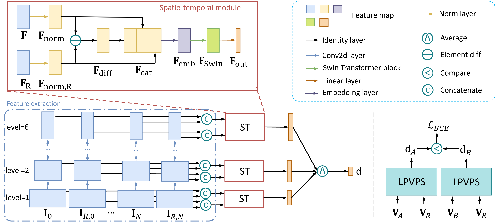

# A Perceptual Quality Metric for Video Frame Interpolation 

### [Paper](https://arxiv.org/abs/2210.01879) | [Data](https://github.com/hqqxyy/VFIPS#training) | [Video](https://web.cecs.pdx.edu/~qiqi2/files/papers/vfips/Video_Demo_Final.mp4) | [Poster](https://web.cecs.pdx.edu/~qiqi2/files/papers/vfips/poster.pdf) 

PyTorch implementation of A Perceptual Quality Metric for Video Frame Interpolation.<br><br>
A Perceptual Quality Metric for Video Frame Interpolation, <br>
 [Qiqi Hou](https://hqqxyy.github.io/) <sup>1</sup>,
 Abhijay Ghildyal <sup>1</sup>,
 [Feng Liu](http://web.cecs.pdx.edu/~fliu/) <sup>1</sup>, <br>
 <sup>1</sup>Portland State University 

in European Conference on Computer Vision (ECCV) 2022.


As video frame interpolation results often exhibit unique artifacts, existing quality metrics sometimes are not consistent with human perception when measuring the interpolation results. Some recent deep learning-based perceptual quality metrics are shown more consistent with human judgments, but their performance on videos is compromised since they do not consider temporal information. In this project, we present a dedicated perceptual quality metric for measuring video frame interpolation results.

### Video
<a href="https://web.cecs.pdx.edu/~qiqi2/files/papers/vfips/Video_Demo_Final.mp4" rel="Video"></a>

### Network
 

### Requirements
System: Ubuntu

Pytorch version: >= Pytorch1.10

GPU memory: >= 12G


### Test on BVI-VFI dataset
1. Download the [BVI-VFI](https://danielism97.github.io/BVI-VFI/) dataset. Set the path in the function `get_dataset_dir` in `utils.py`
```python
    elif dataset == 'bvivfi':
        datadir = 'BVI-VFI_DATASET_PATH'
```

2. Run the testing codes
```bash
python test_bvivfi_fast.py --model=multiscale_v33 --expdir=./exp/eccv_ms_multiscale_v33/ --testset=bvivfi
```


### Training 
1. Download the VFIPS dataset (Please contact with qiqi.hou2012@gmail.com for it.). Set the path in the function `get_dataset_dir` in `utils.py`
```python
    if dataset == 'vfips':
        datadir = 'VFIPS_DATASET_PATH'
```

2. Run the training codes
```bash
python train.py --model=multiscale_v33 --expdir=./exp/eccv_ms_multiscale_v33/
```


## Citation
If you find this code is helpful, please consider to cite our paper.
```
@inproceedings{hou2022vfips,
  title={A Perceptual Quality Metric for Video Frame Interpolation},
  author={Qiqi Hou, Abhijay Ghildyal, Feng Liu},
  year={2022},
  booktitle = {European Conference on Computer Vision},
}
```

If you find any bugs of the code, feel free to send me an email: qiqi.hou2012@gmail.com. You can find more information in my 
[homepage](https://hqqxyy.github.io/).

## Acknowledgments
This work was made possible in part thanks to Research Computing at Portland State University and its HPC resources acquired through NSF Grants 2019216 and 1624776. Source frames are used under a Creative Commons license from Youtube users Ignacio, Scott, Animiles, H-Edits, 3 Playing Brothers, TristanBotteram, popconet, and billisa.
